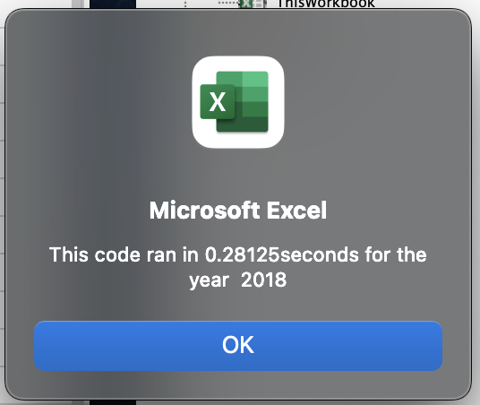
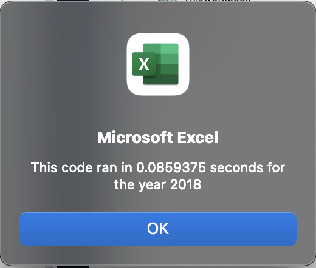

# VBA Refactoring 

## Overview of Project

### Purpose
Refactor code to analyze stock prices to determine Steve's parents best options for investment. 

## Analysis and Challenges
The original code used multiple loops which which was processing intensive. By refactoring the code to take a single pass through the data processing time could be reduced substantially.  

### Original processing time 
- The original code uses a nested for loop that runs through the rows for each ticker which loops through the entire record set for each ticker. The processing time baseline is .28125 seconds. 

###  Refactored processing time 

- By eliminating the nested for loop a single pass could be taken through the dataset. 
- The process time time was reduced to .08593 seconds. 
- Processing time was reduced by 69.4471%  

## Summary
- Refactoring code has the advantage of making it easier to read and more efficient. 
- Refactoring code should not change the original functionality. Any time code is changed; it requires rerunning all tests to ensure that a bug was not introduced as part of the refactoring process. 
- The original code may be simpler to understand as it loops through for each ticker. 
- The refactored code is faster and more efficient but needed to keep track of the ticker change making it slightly more complex but more efficient. 

